# Feature #1: Ingredient Clustering - Visual Flow

## 🎨 Interactive Flow Diagram

```mermaid
graph TB
    Start([🔍 Feature #1: Ingredient Clustering])
    Start --> Path1[📋 Path 1: View All Clusters]
    Start --> Path2[🎯 Path 2: Predict New Ingredient]
    
    subgraph "Path 1: View Clusters"
        User1[👤 User clicks<br/>'View Ingredient Clusters']
        Frontend1[⚛️ React Frontend<br/>loadIngredientClusters]
        API1[🔌 Flask API<br/>GET /api/cluster/ingredients]
        ML1[🤖 K-Means Model<br/>get_clusters]
        Result1[✨ Display 6 Cluster Cards<br/>Protein, Grains, Vegetables,<br/>Dairy, Fats, Fruits]
        
        User1 --> Frontend1
        Frontend1 -->|Axios GET| API1
        API1 --> ML1
        ML1 -->|Return clusters| Result1
    end
    
    subgraph "Path 2: Predict Ingredient"
        User2[👤 User enters nutritional data<br/>Protein, Carbs, Fat, Calories, Fiber]
        Frontend2[⚛️ React Frontend<br/>predictIngredientCluster]
        API2[🔌 Flask API<br/>POST /api/cluster/predict]
        Preprocess[📊 StandardScaler<br/>Normalize features]
        ML2[🤖 K-Means Prediction<br/>kmeans.predict]
        Result2[✨ Show Result<br/>Cluster name + Similar ingredients]
        
        User2 --> Frontend2
        Frontend2 -->|Axios POST| API2
        API2 --> Preprocess
        Preprocess --> ML2
        ML2 -->|Return prediction| Result2
    end
    
    Path1 --> User1
    Path2 --> User2
    
    style Start fill:#667eea,stroke:#333,stroke-width:4px,color:#fff
    style User1 fill:#764ba2,stroke:#333,stroke-width:2px,color:#fff
    style User2 fill:#764ba2,stroke:#333,stroke-width:2px,color:#fff
    style Frontend1 fill:#f093fb,stroke:#333,stroke-width:2px,color:#fff
    style Frontend2 fill:#f093fb,stroke:#333,stroke-width:2px,color:#fff
    style API1 fill:#4facfe,stroke:#333,stroke-width:2px,color:#fff
    style API2 fill:#4facfe,stroke:#333,stroke-width:2px,color:#fff
    style ML1 fill:#43e97b,stroke:#333,stroke-width:2px,color:#fff
    style ML2 fill:#43e97b,stroke:#333,stroke-width:2px,color:#fff
    style Preprocess fill:#38f9d7,stroke:#333,stroke-width:2px,color:#fff
    style Result1 fill:#fa709a,stroke:#333,stroke-width:2px,color:#fff
    style Result2 fill:#fa709a,stroke:#333,stroke-width:2px,color:#fff
```



## 📊 ML Algorithm Details


## 🔄 Data Flow Architecture

```mermaid
sequenceDiagram
    participant U as 👤 User
    participant F as ⚛️ React Frontend
    participant A as 🔌 Flask API
    participant M as 🤖 ML Model
    
    Note over U,M: Path 1: View All Clusters
    U->>F: Click "View Clusters"
    F->>A: GET /api/cluster/ingredients
    A->>M: get_clusters()
    M-->>A: 6 clusters with ingredients
    A-->>F: JSON response
    F-->>U: Display cluster cards
    
    Note over U,M: Path 2: Predict Ingredient
    U->>F: Enter nutritional data
    F->>A: POST /api/cluster/predict
    Note right of A: features: [29, 0, 7, 189, 0]
    A->>M: StandardScaler.transform()
    M->>M: kmeans.predict()
    M-->>A: cluster_id + similar items
    A-->>F: JSON prediction result
    F-->>U: Show purple result box
```



## 🎯 Tech Stack

```mermaid
graph TD
    subgraph "Frontend Layer"
        React[⚛️ React + Vite]
        Tailwind[🎨 Tailwind CSS]
        Axios[📡 Axios HTTP Client]
    end
    
    subgraph "Backend Layer"
        Flask[⚡ Flask API]
        CORS[🔓 Flask-CORS]
    end
    
    subgraph "ML Layer"
        SKLearn[🤖 scikit-learn]
        KMeans[K-Means Algorithm]
        Scaler[StandardScaler]
        NumPy[NumPy Arrays]
        Pandas[Pandas DataFrames]
    end
    
    subgraph "Data Layer"
        Sample[28 Sample Ingredients]
        Features[5 Nutritional Features]
    end
    
    React --> Axios
    Axios --> Flask
    Flask --> SKLearn
    SKLearn --> KMeans
    SKLearn --> Scaler
    KMeans --> NumPy
    Sample --> Features
    Features --> Scaler
    
    style React fill:#61dafb,stroke:#333,stroke-width:2px
    style Flask fill:#000,stroke:#333,stroke-width:2px,color:#fff
    style SKLearn fill:#f7931e,stroke:#333,stroke-width:2px
    style KMeans fill:#43e97b,stroke:#333,stroke-width:2px
```



## 📋 Quick Reference

| Component | Technology | Purpose |
|-----------|-----------|---------|
| **ML Algorithm** | K-Means (scikit-learn) | Cluster 28 ingredients into 6 groups |
| **Features** | 5 nutritional values | Protein, Carbs, Fat, Calories, Fiber |
| **Preprocessing** | StandardScaler | Normalize features for fair comparison |
| **Backend** | Flask + Python | RESTful API with 2 endpoints |
| **Frontend** | React + Vite | Interactive UI with forms and cards |
| **Styling** | Tailwind CSS | Beautiful, responsive design |

## 🚀 API Endpoints

### GET `/api/cluster/ingredients`
Returns all 6 pre-computed clusters

**Response:**
```json
{
  "success": true,
  "clusters": [
    {
      "cluster_id": 0,
      "cluster_name": "Grains & Carbohydrates",
      "count": 5,
      "ingredients": ["rice", "pasta", "bread", "quinoa", "oats"]
    }
  ],
  "total_clusters": 6,
  "algorithm": "K-Means Clustering"
}
```

### POST `/api/cluster/predict`
Predicts cluster for new ingredient

**Request:**
```json
{
  "name": "Turkey",
  "features": [29, 0, 7, 189, 0]
}
```

**Response:**
```json
{
  "success": true,
  "ingredient": "Turkey",
  "cluster_name": "Protein-Rich Foods",
  "similar_ingredients": ["chicken breast", "salmon", "eggs"]
}
```

## ✅ Testing Guide

### Test 1: View Clusters
1. Open http://localhost:5173
2. Click **"View Ingredient Clusters"**
3. ✅ See 6 colorful cluster cards

### Test 2: Predict Turkey
1. Scroll to **"🎯 Predict Ingredient Cluster"**
2. Enter: Turkey, 29, 0, 7, 189, 0
3. Click **"Predict Cluster"**
4. ✅ See: "Belongs to: Protein-Rich Foods"

---

**Status:** ✅ Complete | **Branch:** `feature/ingredient-clustering` | **Demo:** http://localhost:5173
