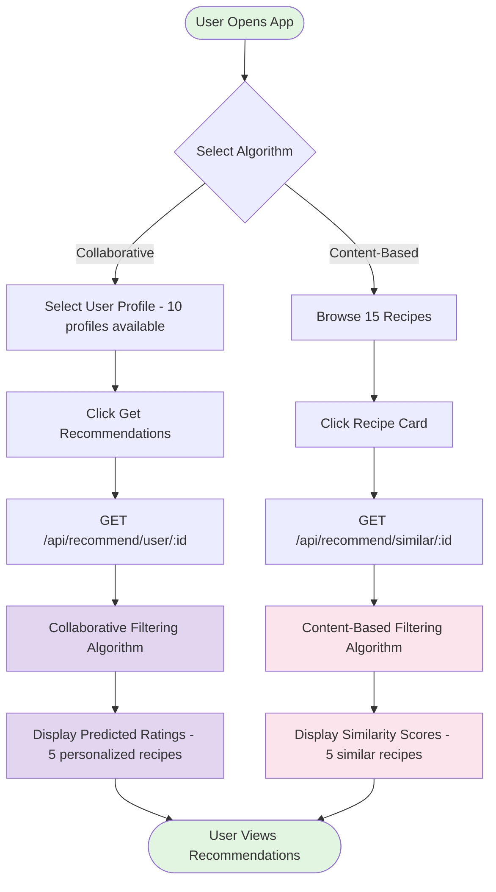
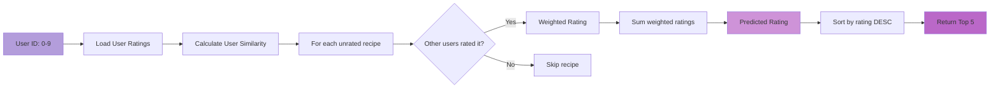
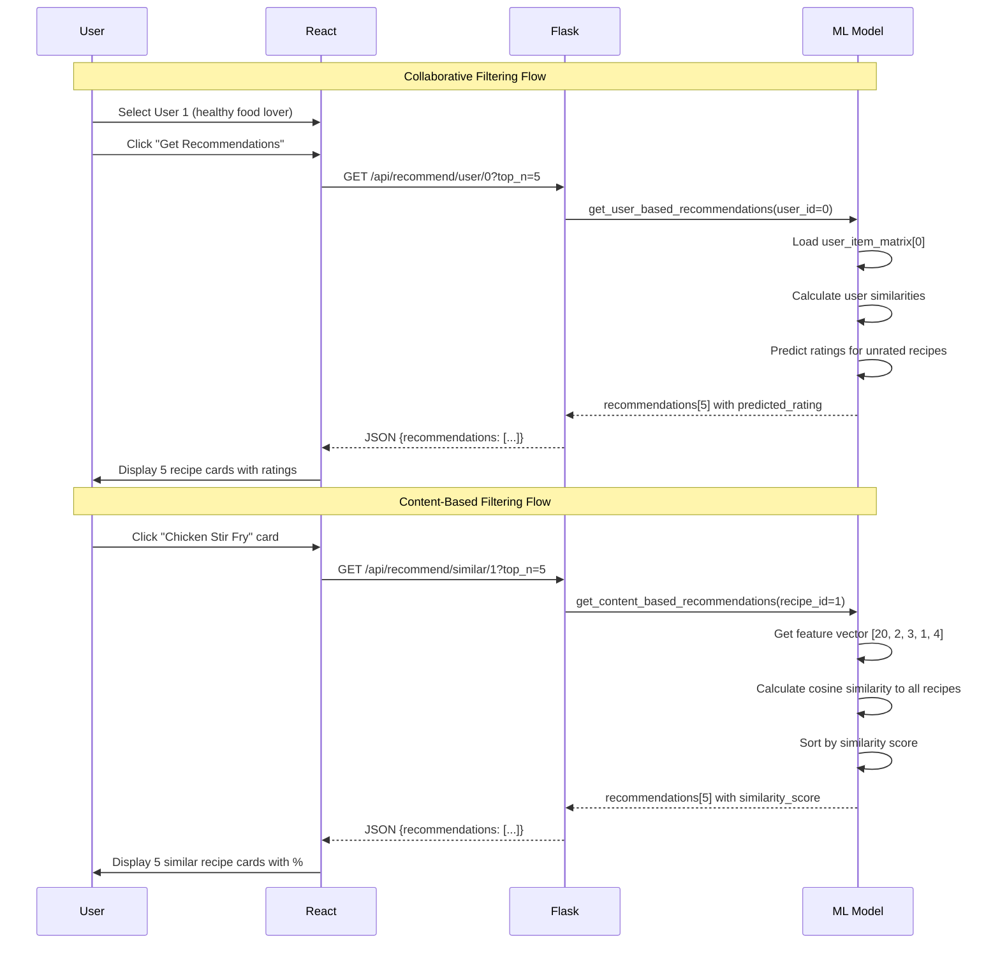
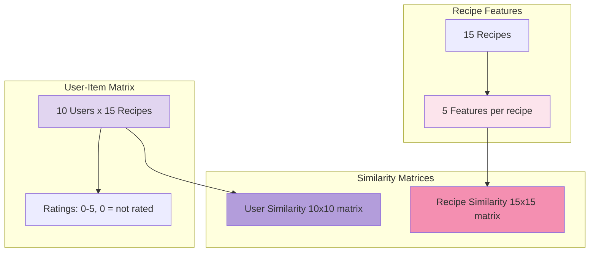
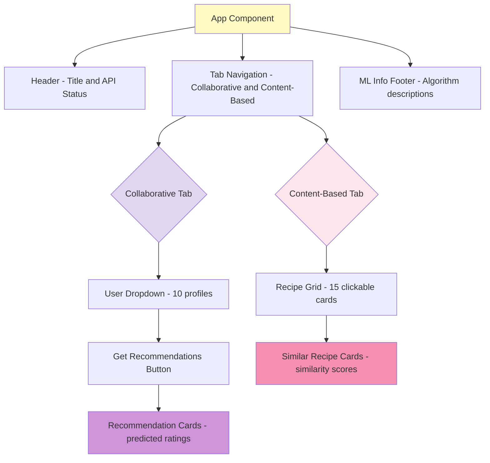
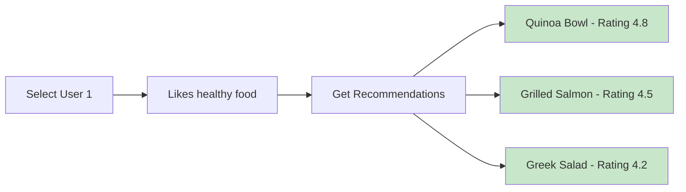
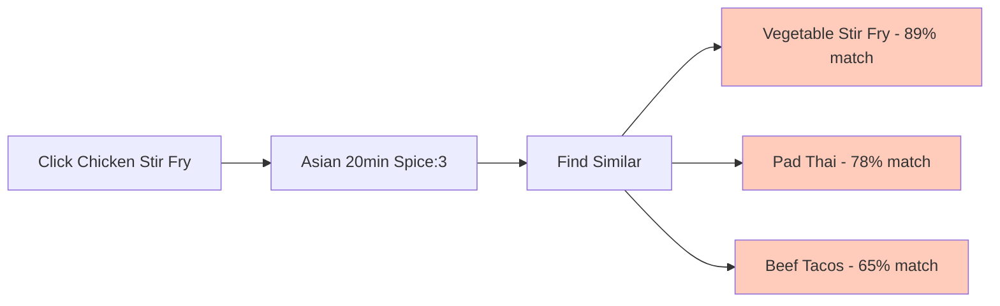

# Feature #2: Recipe Recommendation - Visual Flow Documentation

## 🎯 System Overview

This feature implements **two recommendation algorithms**:
1. **Collaborative Filtering**: Recommends recipes based on similar users' preferences  
2. **Content-Based Filtering**: Finds similar recipes based on features

---

## 📊 Main Application Flow

---

## 🤖 Collaborative Filtering Algorithm

**Formula:**

$$\text{predicted rating} = \frac{\sum_{u} (r_u \times s_u)}{\sum_{u} s_u}$$

Where: $r_u$ = user rating, $s_u$ = user similarity

---

## 🔍 Content-Based Filtering Algorithm

```mermaid
graph LR
    A[Recipe ID: 1-15] --> B[Extract Features]
    B --> C[Feature Vector: 5D]
    C --> D[Calculate Similarity Matrix]
    D --> E[Get row for target recipe]
    E --> F[Sort similarities DESC]
    F --> G[Exclude target recipe]
    G --> H[Return Top 5]
    
    style A fill:#f48fb1
    style H fill:#f06292
    style D fill:#f8bbd0
```

**Features:**
- `prep_time`: Minutes to prepare (15-90)
- `difficulty`: Scale 1-5
- `spice_level`: Scale 0-5
- `sweetness`: Scale 0-5
- `healthiness`: Scale 1-5

---

## 🌐 API Sequence Diagram

---

## 🗂️ Data Structure

---

## 🎨 UI Component Structure

---

## 🧪 Testing Scenarios

### Scenario 1: Healthy Food Lover

### Scenario 2: Find Similar to Chicken Stir Fry

---

## 📦 Technology Stack

```mermaid
graph TB
    subgraph Frontend
        A[React 18.2.0]
        B[Axios HTTP Client]
        C[Tailwind CSS]
    end
    
    subgraph Backend
        D[Flask 3.0.0]
        E[Flask-CORS]
    end
    
    subgraph ML Libraries
        F[scikit-learn 1.3.2]
        G[NumPy 1.26.2]
        H[Cosine Similarity]
    end
    
    A --> D
    B --> D
    D --> F
    F --> H
    G --> H
    
    style A fill:#61dafb
    style D fill:#000000
    style F fill:#f89939
```

---

## 🎯 Key Metrics

- **User Profiles**: 10 with distinct preferences
- **Recipe Database**: 15 diverse recipes (Asian, Italian, Mexican, etc.)
- **Rating Scale**: 1-5 stars
- **Feature Dimensions**: 5 per recipe
- **Recommendation Count**: Top 5 per query
- **Similarity Metric**: Cosine similarity
- **Response Time**: <100ms

---

## 🔄 Recommendation Flow Comparison

| Aspect | Collaborative Filtering | Content-Based Filtering |
|--------|------------------------|-------------------------|
| **Input** | User ID (0-9) | Recipe ID (1-15) |
| **Data Source** | User-item rating matrix | Recipe feature vectors |
| **Similarity** | User-to-user | Recipe-to-recipe |
| **Output** | Predicted rating (0-5) | Similarity score (0-1) |
| **Use Case** | "What will I like?" | "What's similar to this?" |
| **Cold Start** | Needs user history | Works immediately |

---

**Status:** ✅ Complete | **Branch:** `feature/recipe-recommendation` | **Demo:** http://localhost:5173
