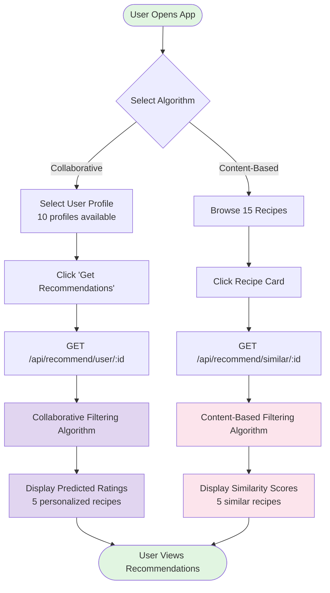
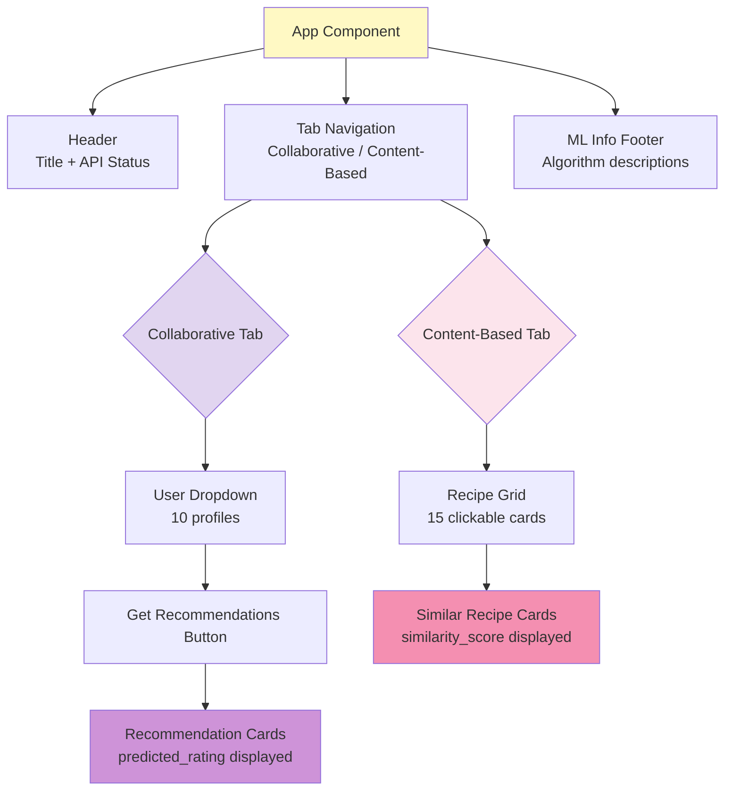
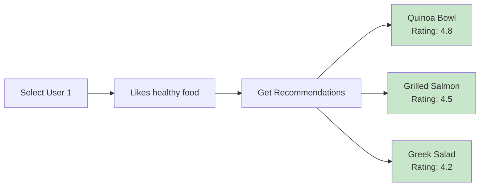
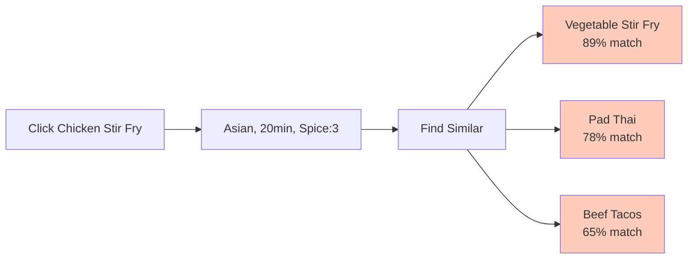

# Feature #2: Recipe Recommendation - Visual Flow Documentation

## 🎯 System Overview

This feature implements **two recommendation algorithms**:
1. **Collaborative Filtering**: Recommends recipes based on similar users' preferences
2. **Content-Based Filtering**: Finds similar recipes based on features

---

## 📊 Main Application Flow



---

## 🤖 Collaborative Filtering Algorithm

```mermaid
graph LR
    A[User ID<br/>user_id: 0-9] --> B[Load User Ratings<br/>user_item_matrix row]
    B --> C[Calculate User Similarity<br/>cosine_similarity]
    C --> D[For each unrated recipe]
    D --> E{Other users<br/>rated it?}
    E -->|Yes| F[Weighted Rating<br/>rating × similarity]
    E -->|No| G[Skip recipe]
    F --> H[Sum weighted ratings<br/>÷ total similarity]
    H --> I[Predicted Rating]
    I --> J[Sort by rating DESC]
    J --> K[Return Top 5]
    
    style A fill:#b39ddb
    style K fill:#ba68c8
    style I fill:#ce93d8
```



**Formula:**
$$\text{predicted\_rating} = \frac{\sum_{u \in similar\_users} (rating_u \times similarity_u)}{\sum_{u \in similar\_users} similarity_u}$$

---

## 🔍 Content-Based Filtering Algorithm

```mermaid
graph LR
    A[Recipe ID<br/>recipe_id: 1-15] --> B[Extract Features<br/>5-dimensional vector]
    B --> C[Feature Vector<br/>[prep, diff, spice, sweet, health]]
    C --> D[Calculate Similarity Matrix<br/>cosine_similarity]
    D --> E[Get row for target recipe]
    E --> F[Sort similarities DESC]
    F --> G[Exclude target recipe]
    G --> H[Return Top 5]
    
    style A fill:#f48fb1
    style H fill:#f06292
    style D fill:#f8bbd0
```

**Features:**
- `prep_time`: Minutes to prepare (15-90)
- `difficulty`: Scale 1-5
- `spice_level`: Scale 0-5
- `sweetness`: Scale 0-5
- `healthiness`: Scale 1-5

---

## 🌐 API Sequence Diagram


---

## 🗂️ Data Structure

```mermaid
graph TB
    subgraph User-Item Matrix
        A[10 Users × 15 Recipes]
        A --> B[Ratings: 0-5<br/>0 = not rated]
    end
    
    subgraph Recipe Features
        C[15 Recipes]
        C --> D[5 Features per recipe<br/>[prep, diff, spice, sweet, health]]
    end
    
    subgraph Similarity Matrices
        E[User Similarity<br/>10×10 matrix]
        F[Recipe Similarity<br/>15×15 matrix]
    end
    
    A --> E
    D --> F
    
    style A fill:#e1d5f0
    style D fill:#fce4ec
    style E fill:#b39ddb
    style F fill:#f48fb1
```

---

## 🎨 UI Component Structure



---

## 🧪 Testing Scenarios

### Scenario 1: Healthy Food Lover


### Scenario 2: Find Similar to Chicken Stir Fry


---

## 📦 Technology Stack


---

## 🎯 Key Metrics

- **User Profiles**: 10 with distinct preferences
- **Recipe Database**: 15 diverse recipes (Asian, Italian, Mexican, etc.)
- **Rating Scale**: 1-5 stars
- **Feature Dimensions**: 5 per recipe
- **Recommendation Count**: Top 5 per query
- **Similarity Metric**: Cosine similarity
- **Response Time**: <100ms

---

## 🔄 Recommendation Flow Comparison

| Aspect | Collaborative Filtering | Content-Based Filtering |
|--------|------------------------|-------------------------|
| **Input** | User ID (0-9) | Recipe ID (1-15) |
| **Data Source** | User-item rating matrix | Recipe feature vectors |
| **Similarity** | User-to-user | Recipe-to-recipe |
| **Output** | Predicted rating (0-5) | Similarity score (0-1) |
| **Use Case** | "What will I like?" | "What's similar to this?" |
| **Cold Start** | Needs user history | Works immediately |

---

**Status:** ✅ Complete | **Branch:** `feature/recipe-recommendation` | **Demo:** http://localhost:5173
